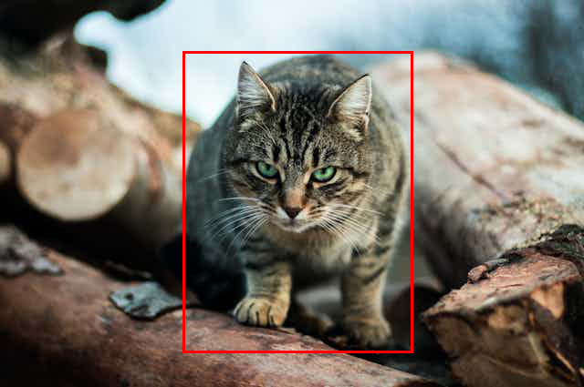
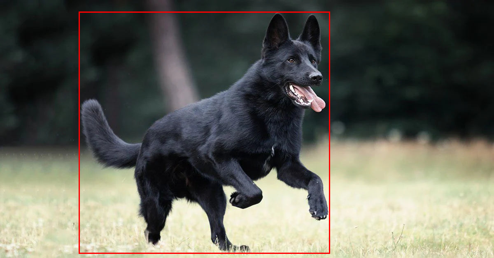
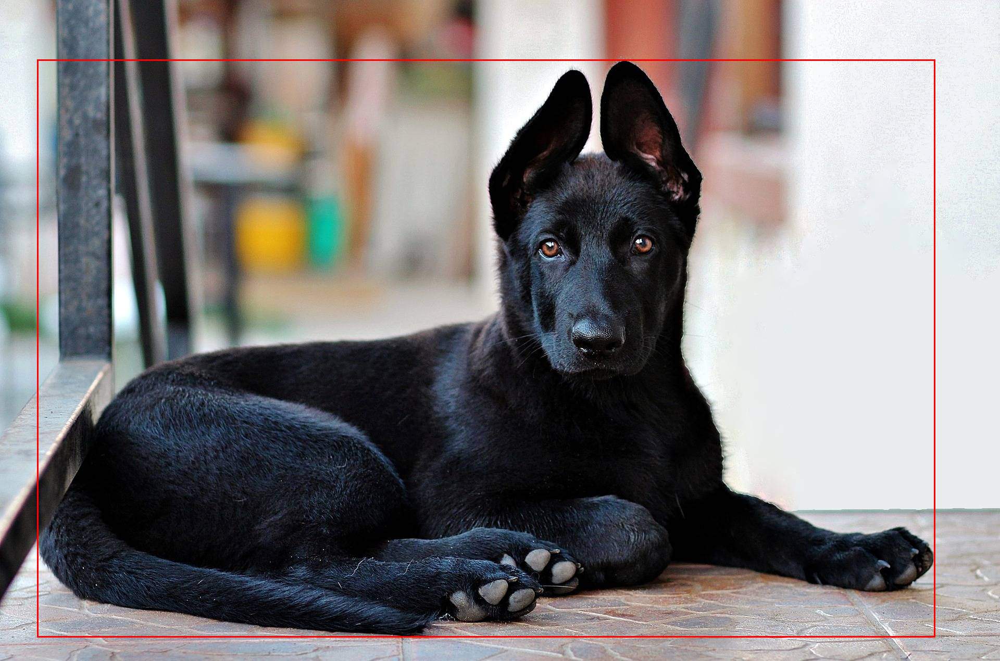

# ICL Detection Walkthrough

This folder shows how to run Perceptron's `detect` helper with in-context learning (ICL) examples.

## Assets
- `classA.jpg` – cat exemplar for class `classA`
- `classB.webp` – dog exemplar for class `classB`
- `input.png` – target image to classify after seeding the model with the exemplars
- `classA_boxed.png`, `classB_boxed.png`, `input_boxed.png` – reference visualizations generated from the normalized boxes

| Exemplar Preview | Normalized bbox (0–1000) | Pixel bbox (scaled) |
| --- | --- | --- |
|  | `(316,136,703,906)` | `(202,58,450,385)` |
|  | `(161,48,666,980)` | `(193,30,799,615)` |
|  | `(38,91,934,962)` | `(73,116,1793,1222)` |

> The model emits box coordinates on a 0–1000 grid (percent-style). Convert to pixel space only when visualizing or computing metrics; feed the normalized values directly back into the model for ICL.

Run the steps below from the repo root after installing the project (e.g. `pip install -e .`).

## 1. Export credentials
```bash
export FAL_KEY="YOUR_FAL_KEY"
```
The SDK auto-detects `FAL_KEY`, so no additional configuration is required. The sample outputs below were produced on 2025-09-23 using an internal test key.

## 2. Bootstrap exemplar boxes (cat ↔ classA, dog ↔ classB)
Use the high-level helper once on each exemplar to harvest tight bounding boxes:
```python
from perceptron import detect

for path, label in [
    ("examples/icl_detection/classA.jpg", "classA ↔ cat"),
    ("examples/icl_detection/classB.webp", "classB ↔ dog"),
]:
    res = detect(path, classes=["cat", "dog"])
    print(f"{label}: {res.text}")
    for box in res.points or []:
        print("  ", box)
```
Example output:
```
classA ↔ cat: <point_box mention="cat"> (316,136) (703,906) </point_box>
   BoundingBox(top_left=(316,136), bottom_right=(703,906), mention='cat')
classB ↔ dog: <point_box mention="dog"> (161,48) (666,980) </point_box>
   BoundingBox(top_left=(161,48), bottom_right=(666,980), mention='dog')
```
Map these normalized coordinates to your abstract labels and store them for reuse in the ICL examples.

## 3. Run detection with ICL examples
```python
from perceptron import detect, annotate_image, bbox

cat_example = annotate_image(
    "examples/icl_detection/classA.jpg",
    {"classA": [bbox(316,136,703,906, mention="classA")]},
)

dog_example = annotate_image(
    "examples/icl_detection/classB.webp",
    {"classB": [bbox(161,48,666,980, mention="classB")]},
)

res = detect(
    "examples/icl_detection/input.png",
    classes=["classA", "classB"],
    examples=[cat_example, dog_example],
)

print(res.text)
for box in res.points or []:
    print(box)
```
Sample result:
```
<point_box mention="classB"> (38,91) (934,962) </point_box>
BoundingBox(top_left=(38,91), bottom_right=(934,962), mention='classB')
```
This indicates the model localized the dog in `input.png` after being primed with the cat/dog exemplars.

## Notes
- `annotate_image` takes care of serializing the bounding boxes for the few-shot turns.
- You can swap in alternative exemplar boxes (or add more classes) by modifying the dictionaries passed to `annotate_image`.
- When running in other environments, set `PERCEPTRON_PROVIDER` and `PERCEPTRON_API_KEY` instead of `FAL_KEY` if required.

### Visualizing bounding boxes (optional)
The preview PNGs were generated by scaling the normalized coordinates into pixel space:

```python
from pathlib import Path
from PIL import Image, ImageDraw

BOXES = {
    'classA': ('classA.jpg', (316, 136, 703, 906)),
    'classB': ('classB.webp', (161, 48, 666, 980)),
    'input': ('input.png', (38, 91, 934, 962)),
}

root = Path('examples/icl_detection')
for label, (filename, (x1, y1, x2, y2)) in BOXES.items():
    img = Image.open(root / filename).convert('RGB')
    w, h = img.size
    x1p = round(x1 / 1000 * w)
    y1p = round(y1 / 1000 * h)
    x2p = round(x2 / 1000 * w)
    y2p = round(y2 / 1000 * h)
    draw = ImageDraw.Draw(img)
    for offset in range(3):
        draw.rectangle((x1p-offset, y1p-offset, x2p+offset, y2p+offset), outline='red')
    img.save(root / f"{label}_boxed.png")
```
